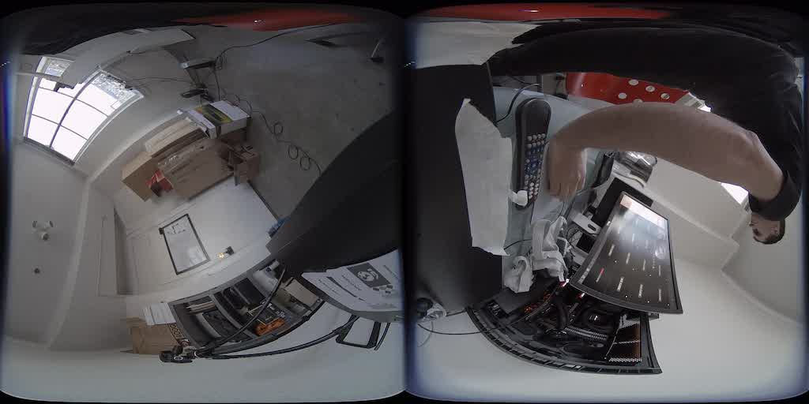

# FisheyeToEquirectangular



Scripts for converting pairs of Hikvision fisheye videos to equirectangular videos. This code has been tested on Mac and Linux.

# Install

First install [Anaconda](https://www.anaconda.com/distribution/). Then ffmpeg, OpenCV, and a few Python libraries. OpenCV installed by Anaconda needs Python 3.6.

```
$ conda create -n py36 python=3.6
$ conda activate py36
$ conda install opencv
$ pip3 install tqdm ffmpeg-python python-dateutil pillow
```

By default `opencv` includes a version of ffmpeg that does not have `libx264` enabled, so you will need to install a different version:

```
$ conda install x264=='1!152.20180717' ffmpeg=4.0.2 -c conda-forge
```

Now you need this code and some Python utils:

```
$ git clone git@github.com:kylemcdonald/FisheyeToEquirectangular.git
$ cd FisheyeToEquirectangular
$ git clone git@github.com:kylemcdonald/python-utils.git utils
```

We'll also create an alias to our drive with the footage to keep things simple:

```
$ ln -s /Volumes/EXPORT EXPORT # Mac
$ ln -s /media/kyle/EXPORT EXPORT # Linux
```

# Usage

Searching for files:

```
$ python find.py -i /media/kyle/EXPORT/ -t "6/26/2019 18:23:00" -c 3 4
EXPORT/ch03_20190626181035.mp4 +745 seconds
EXPORT/ch04_20190626181114.mp4 +706 seconds
Extract near beginning of files:
  -l EXPORT/ch03_20190626181035.mp4 --skip_left 936 -r EXPORT/ch04_20190626181114.mp4 --skip_right 0
Extract from 6/26/2019 18:23:00:
  -l EXPORT/ch03_20190626181035.mp4 --skip_left 17880 -r EXPORT/ch04_20190626181114.mp4 --skip_right 16944
```

These parameters can be pasted into the unwarper. Before using the unwarper make sure to enable the Python 3.6 environment with OpenCV.

```
$ conda activate py36
$ python unwarp.py \
    -o out.mp4 \
    -l EXPORT/ch03_20190626181035.mp4 --skip_left 936 \
    -r EXPORT/ch04_20190626181114.mp4 --skip_right 0 \
    -d 10
```

This will output a 10 second clip from near the beginning of the file.

If the audio isn't perfectly synced, you might need to open the clip in an audio editor and find how many frames offset the audio is. Then adjust the skip amounts accordingly.
